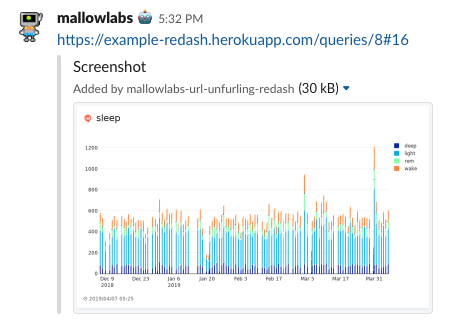

# slack-unfurling-redash

A Slack unfruling Lambda function for Redash (self hosting).
It based on AWS SAM(Serverless application mode).



## Requirements

* AWS CLI
* SAM CLI

## Deploy

### Slack side

#### 1. Create Slack App

https://api.slack.com/apps

#### 2. `Event Subscriptions` setting

`Enable Events` Set to On

`App Unfurl Domains` Add your Redash hostname.

Click `Save Changes`.

#### 3. `OAuth & Permissions` setting

Added `links:write` to `Scopes`.

Click `Save Changes`.

Click `Install App to Workspace`.

Remember your `OAuth Access Token`.

### Lambda side

```bash
$ aws s3 mb s3://your-sandbox --region ap-northeast-1
```

```bash
$ cd slack-unfurling-redash
$ npm i
```

```bash
$ sam package \
    --template-file template.yaml \
    --output-template-file serverless-output.yaml \
    --s3-bucket your-sandbox
```

```bash
$ sam deploy \
    --template-file serverless-output.yaml \
    --stack-name your-slack-unfurling-redash \
    --capabilities CAPABILITY_IAM \
    --parameter-overrides \
      BucketName=your-bucket \
      RedashApiKey=your-redash-api-key \
      SlackOauthToken=your-slack-oauth-token
```

Confirm your endpoint url.

```bash
$ aws cloudformation describe-stacks --stack-name your-slack-unfurling-redash --region ap-northeast-1
```

### Slack side
Input your endpoint url to `Request URL` in `Event Subscriptions`.

Click `Save Changes`.

## Credit

This project refered [getredsah/snap](https://github.com/getredash/snap).
Many thanks to Redash team.
